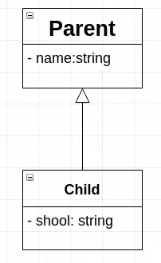
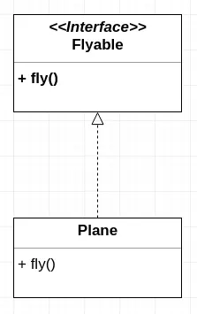
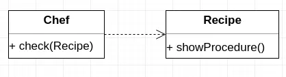
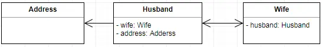
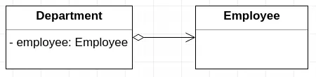
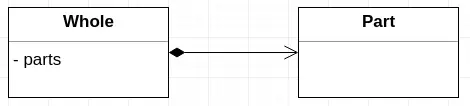

## 设计模式

#### UML六种关系
1. 泛化:(Generalization):

&ensp;&ensp;表示继承关系, 表示类/接口对父类/接口的功能扩展.
java语法中的extends, 用来扩展父类或父接口的功能.
图形表示: 带三角箭头的实线, 箭头指向父类或父接口.



2. 实现(Realization):

&ensp;&ensp;表示类实现接口定义的行为或功能.
java语法中的implements.
图形表示:带三角箭头的虚线, 箭头指向接口.



```java
class Plane implements Flyable{
      public void fly() {}
}
```

3. 依赖(Dependency):

&ensp;&ensp;表示使用关系, A需要B的协助来完成工作形成的关系, 但是这种使用关系具有临时性的特点. 比如, 厨师在烹饪的时候看了一眼菜谱, 厨师"使用"了菜谱, 照着它炒完菜后,这种使用关系就结束了(临时性).
java的语法中, 被依赖的对象/类, 以方法参数, 局部变量和静态方法调用的形式出现.
图形表示: 因为依赖和被依赖关系比较弱, 所以使用虚线+箭头表示. 箭头指向被依赖者.而且一般是单向关系.



```java
class Chef {
       public void check(Recipe r) {
            r.showProcedure();
       }
  }  
```

4. 关联(Association):

&ensp;&ensp;关联关系,表示"拥有", 相比依赖关系的临时性和单向性, 关联关系具有长期性, 平等性(可双向),所以关联表示的关系比依赖更强. 比如现实生活中的夫妻, 师生等关系. 长期存在并且是相互的关系. 此外关联可以表示一对一,一对多, 多对一, 多对多等各种关系.

&ensp;&ensp;java语法中, 被拥有者作为拥有者的成员变量存在.

&ensp;&ensp;图形表示: 因为比依赖关系更强, 所以是实线+箭头.双向关联可以省略箭头
后面两种关系 "聚合" 和 "组合", 都属于关联关系, 用来表示关联关系中整体与部分的关系, 虽然各有特点, 但既然都属于关联关系, 它们在语法上是没有区别的, 都是用成员变量表达.



```java
  class Husband {
      private Wife wife;
      private Address address;
  }
  class Wife {
      private Husband husband;
  }
```

5. 聚合(Aggregation):

&ensp;&ensp;表示"has-a"关系, 整体与部分的关系, 这种关系相对于组合弱一些, 整体与部分是可分离的.

&ensp;&ensp;比如, 部门与员工, 部门有许多员工, 员工离职了, 部门仍然存在,并不会受到影响, 部门解散了,员工可以去其他部门(整体与部分可分离)

图形表示: 空心菱形+实线+箭头, 箭头指向部分, 菱形指向整体.



6. 组合(Composition):

&ensp;&ensp;表示"contains-a"的关系. 是一种组装的关系. 并且整体与部分是不可分离的. 比起聚合限制更强了. 这种关系中,整体与部分的生命周期是一致的, 这个限制是非常这严苛的, 以至于在现实中很难找到符合的示例.

&ensp;&ensp;但是在程序中,反而很好实现, 因为我们可以完全掌控对象的生命周期. 所以这种关系并不是对现实世界中某类关系的抽象, 而是具体的, 战术性的逻辑工具, 设计者使用它来表达类之间的这种强限制.

&ensp;&ensp;例如, 在现实中, 人体和器官(整体和部分)的生命周期并不一致. 但设计的系统中并不支持器官移植之类的功能, 所以器官单独出现在系统中就没有意义, 使用组合可以明确表达这种目的.

&ensp;&ensp;这也是组合唯一的目的,表示给整体与部分的关系加一层限制,而不是直接对问题域中的关系建模. 操作上可以先识别聚合(整体与部分)关系. 然后判断如果部分在整体的概念之外没有存在的意义, 就可以确定为组合.

&ensp;&ensp;而在具体实现上, 可以将部分完全作为整体的内部状态, 比如私有的内部类. 这种强限制关系使用比较少.

图形表示: 实心菱形+ 实线+ 箭头, 菱形指向整体, 箭头指向部分



#### 设计模式课程案例demo
1. 外观模式
2. 行为模式和命令模式
3. 桥接模式
4. 结合模式
5. 装饰模式
6. 享元模式
7. 解释器模式和迭代器模式
8. 工厂模式
9. 中介者和备忘录
10. 网络模式
11. 代理模式
12. 单例模式

参考资料
[简书作者：耿耿不寐如有隐忧](https://www.jianshu.com/p/f35fab1640c6)
